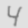
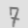

# Overview

The code in this repository can be used to train any neural network provided in the [torchvision.models](https://pytorch.org/vision/stable/models.html) package on the MNIST dataset.

These networks are trained using Pytorch 1.10.1. The training uses the Adam optimizer with a standard parameter configuration. No data augmentation was used in the training. The code registers and tracks experiment results using MLflow.

The repository also includes functionality to produce an ensemble predictor. This ensemble generates outputs combining predictions provided by multiple networks.

The code also contains functionality to produce submissions to the [Digit Recognizer](https://www.kaggle.com/c/digit-recognizer) Kaggle competition for these prediction algorithms.

Several experiments were carried over to evaluate these models, and generate submissions to the Kaggle competition. Please see [Experimental Results](#experimental-results) section below. The ensemble predictor produced with this code was able to reach [9% top position in the leaderboard of the Kaggle competition](https://www.kaggle.com/reanor/competitions?tab=active).

# Code Usage

## Setting up Work Environment

The code was tested with Python version 3.6.9. A virtual environment to use the code can be created with the following command line, and then activated:

    python3 -m virtualenv Kaggle_Digit_Recognizer --python=/usr/bin/python3.6
    source Kaggle_Digit_Recognizer/bin/activate

The execution of the training requires several packages, including Pytorch, Pandas or Kaggle. These can be automatically installed with the following command line:

    pip3 install -r requirements.txt --force-reinstall

## Downloading data

Using the kaggle command line tool:

    kaggle competitions download -c digit-recognizer
    unzip -d data digit-recognizer.zip

## Training
### On Host

The script [src/train.py](src/train.py) can be used to train networks available in the [torchvision.models](https://pytorch.org/vision/stable/models.html) package. The following line will train a network on MNIST, provided the name of the network architecture and the number of epochs for the training:

    python3 -u src/train.py --model_name <name> --epochs <num_epochs>

Example:

    python3 -u src/train.py --model_name resnet34 --epochs 10

The following command displays a list of the network architectures available for training:

    python3 -u src/train.py --help

The script [scripts/batch_train.sh](scripts/batch_train.sh) can be used to train several network architectures sequencially, including Resnet, Mobilenet or EfficientNet.

### Inside Container

Alternatively, the training can be launched within the docker container provided in the source code. For that purpose, the docker image must be build first:

    docker build . -t digit-recognizer

The docker image will contain the Python version and all the packages required to run the training.

The following command can be used to run the training from the docker container:

    docker run --gpus all -v $(pwd):/mnt digit-recognizer python3 -u <training_command>

For example, the following command trains a single network:

    docker run --gpus all -v $(pwd):/mnt digit-recognizer python3 -u ./src/train.py --model_name resnet18 --epochs 10

And this one will run the batch training:

    docker run --gpus all -v $(pwd):/mnt digit-recognizer ./scripts/batch_train.sh

## Visualizing Results

Each execution of the script _src/train.py_ will register training results (model, metrics, etc...) in a separate MLflow experiment. By default, these experiments will be stored inside the _mlruns/0_ folder.

These experiments can be visualized using the MLflow UI, which can be launched with the following command:

    mlflow ui

Typically, the UI can be accessed to visualize the experiments by opening the following URL in any browser:

    http://127.0.0.1:5000/

## Generating Kaggle Submissions

After training a model with the _src/train.py_ script, the script [src/generate_submission.py](src/generate_submission.py) can be used to generate the Kaggle submission file _submission.csv_:

    python3 -u src/generate_submission.py <model_file>

The submission files can also be generated in bulk with the script [scripts/parse_results.sh](scripts/parse_results.sh). It will not only produce submission files for all the networks trained with the _train.py_ script, but it will also produce the predictions for the ensemble method in the file _submission_ensemble.csv_.

# Experimental Results

## Architecture Exploration

The first experiment evaluated the accuracy achievable by different network architectures in the Python model zoo. The results can be seen in the following table:

| Architecture  | Validation Accuracy  | Test Accuracy (Kaggle)  | Inference time (ms/batch) |
|---                    |---            |---            |---        |
| resnet18              | 0.9945        | 0.99398       | 0.1555    |
| resnet34              | **0.9950**    | 0.99403       | 0.2880    |
| resnet50              | 0.9946        | **0.99442**   | 0.5511    |
| resnet101             | 0.9942        | 0.99271       | 0.9370    |
| mobilenet_v2          | 0.9949        | 0.99342       | 0.1907    |
| mobilenet_v3_small    | 0.9815        | 0.97871       | 0.1742    |
| mobilenet_v3_large    | 0.9929        | 0.99060       | 0.2421    |
| squeezenet1_0         | 0.9933        | 0.99203       | **0.0913**|
| squeezenet1_1         | 0.9886        | 0.98725       | 0.1010    |
| efficientnet_b0       | 0.9935        | 0.99214       | 0.3589    |
| efficientnet_b3       | 0.9905        | 0.98867       | 0.6917    |
| mnasnet0_5            | 0.7882        | 0.78892       | 0.1429    |
| mnasnet1_0            | 0.9876        | 0.98467       | 0.2218    |

Resnet50, the network with top test accuracy, provided a 0.99442 test accuracy, reaching position 254/2055 (top 12,36%) in the leaderboard for the _Digit Recognizer_ Kaggle competition.

## Ensemble Prediction

The second experiment evaluated the performance of a simple ensemble predictor. For a given test sample, the ensemble yields the most frequent prediction given by the following networks:
- resnet18
- resnet34
- mobilenet_v2
- mobilenet_v3_large
- squeezenet1_0
- efficientnet_b0

This ensemble method yielded a 0.99535 accuracy, which reached position 176/2055 (top 8,56%) in the Kaggle leaderboard.

An estimation for the combined inference time for this predictor would be 1,1358ms per batch, according to the results in the table above.

## Reducing Overfitting

Most networks used in these experiments include ways to reduce overfitting (e.g. batch normalization, dropout). To further try and reduce overfitting two additional techniques were tested in the training: image augmentation and weight decay.

Since all images in the MNIST dataset are binary BW, there is no value in trying color or brigthness augmentations. Hence,slight geometric transformations are the most adequate for a dataset such as MNIST.

For an initial test of image augmentations it is convenient to use mild transformations. Hence, for these experiments we applied random rotations within a range of [-4, 4] degrees, scaling and translation with 2% of variation in image size. Examples of this transformation can be seen as follows:

Using the command line parameter _--augment_ the training script will apply these transformations during training. Besides affine transformations, the training can also apply weight decay by setting a non-zero value in the _--l2_reg_ command line parameter.

The validation errors obtained by applying these two techniques can be seen in the following table (where WD=weight decay, AUG=agumentations). Highlighted in bold typeface are experiments that improved w.r.t. the baseline:

| Architecture          | Baseline  | Baseline+WD   | Baseline+WD+AUG   |
|---                    |---        |---            |---                |
| resnet18	            | 0.9945	| **0.9948**	| **0.9963**	    |
| resnet34	            | 0.9950	| **0.9951**	| **0.9956**	    |
| resnet50	            | 0.9946	| **0.9950**	| **0.9954**	    |
| resnet101	            | 0.9942	| **0.9945**	| **0.9956**	    |
| efficientnet_b0	    | 0.9935	| 0.9871	    | 0.9931	        |
| mobilenet_v3_small	| 0.9815	| **0.9817**	| **0.9838**	    |
| mobilenet_v3_large	| 0.9929	| 0.9915	    | 0.9921	        |
| mobilenet_v2	        | 0.9951	| 0.9932	    | 0.9945	        |

With these updated results we evaluated the performance of version 2 of the ensemble. This new version uses the following updated networks that provided the best results after these experiments:
- resnet18 (Baseline+WD+AUG)
- resnet34 (Baseline+WD+AUG)
- mobilenet_v2 (Baseline)
- mobilenet_v3_large (Baseline)
- squeezenet1_0 (Baseline)
- efficientnet_b0 (Baseline)

This new ensemble yielded an accuracy of 0.99550. It improves the performance of V1 (0.99535_), climbing some positions from 176/2055 to 162/2055 (top 7.88%) in the Kaggle leaderboard.

## Conclusions

The ensemble method would be the best choice for applications where accuracy is the crucial factor.

Meanwhile, for applications where the computation cost or prediction time is also a crucial factor (e.g. mobile apps), a network like _squeezenet_1_0_ can provide very competitive results compared to the best result obtained by the ensemble.

The accuracy for the ensemble is just 2% higher than the accuracy for _squeezenet 1.0_. Meanwhile, the processing time per batch is 12.4 times larger.

## Further Experiments

The first experiment tried to optimize the accuracy by exploring different choices for the network architecture. Additional network architectures could have been considered for the experiments. Additionally, other hyperparameters such as the optimization method, or the learning rate, could have been optimized in the experiments. Training longer with SGD with a more conservative LR decay or larger batch sizes can typically provide improvements in accuracy.

[More sophisticated approaches](https://paperswithcode.com/sota/image-classification-on-mnist) have been also proposed in the academic literature, reaching accuracies in the range of 0,9991 for the digit classification problem with MNIST. Any of these ideas could be explored to further push the prediction accuracy of the models.
